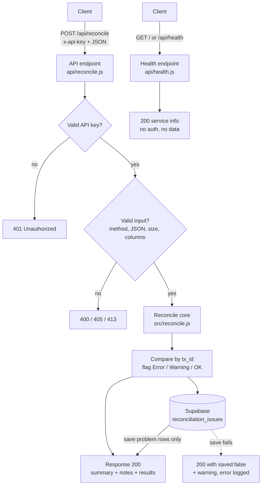

# Bank Reconciliation Engine

A small serverless API that compares transactions from **two banks** and a
**company ledger**, then flags anything that doesn't line up — duplicates,
missing entries, wrong amounts, name typos, and date gaps.

## The problem it solves

At month-end, finance teams often reconcile by hand: open the bank statements
next to the accounting ledger and tick off each transaction. It's slow, it's
boring, and it's easy to miss a swapped digit or a payment that never arrived.
A single missed mismatch can mean books that don't balance.

This project does that comparison automatically. You send it the bank and ledger
rows; it returns a clean list of problems (worst first) so a human only has to
review the handful of rows that actually need attention.

> **Note:** All data in this repository is **simulated**. The sample files in
> `test/fixtures/` contain no real bank data, account numbers, or personal
> information.

## What it checks

For every transaction ID it reports one of three severities:

| Check | What it means | Severity |
|-------|---------------|----------|
| **Duplicate** | The same transaction ID appears more than once in a bank or in the ledger | Error |
| **Missing in Ledger** | The bank has it, but the ledger doesn't | Error |
| **Missing in Bank** | The ledger has it, but no bank does | Error |
| **Amount Mismatch** | Same ID, but the bank and ledger amounts differ | Error |
| **Name Mismatch** | Same ID and amount, but the party names differ (e.g. "Rahul Verma" vs "Rohit Verma") | Warning |
| **Date Mismatch** | Same ID, but the dates differ by **more** than the bank's tolerance window | Warning |
| **Matched** | Everything agrees — or the date gap is **within** the window (e.g. "posted 2 days late") | OK |

**Why Error vs Warning?** An **Error** is almost certainly a real problem that
needs fixing (money missing, wrong amount, a duplicate). A **Warning** is worth a
human glance but often explainable — a party name typed slightly differently, or
a posting date further out than expected.

**Date tolerance.** Banks often post a payment a day or two after the company
records it, so a small date gap isn't a real problem. Each result is compared
against a tolerance window (default **3 days**). A gap **within** the window comes
out **Matched** with a note like `"posted 2 days late"` (or `"early"` if the bank
date is before the ledger date); a gap **larger** than the window is a
**Warning**. Every result row also carries `days_diff` (the size of the gap) and
`note`. See [Date tolerance settings](#date-tolerance-settings).

## Architecture



## The journey

This engine was built in three phases:

- **Phase 1 — n8n MVP.** The reconciliation logic was first prototyped as a
  single Code node in [n8n](https://n8n.io/), reading the three sources from a
  spreadsheet and printing mismatches. It proved the idea worked.
- **Phase 2 — n8n, hardened.** Added a webhook trigger so it could be called on
  demand, plus proper error handling for bad or missing data. When a workflow
  error occurred — for example a bank renaming a column — an AI step suggested a
  fix, and a human reviewed and approved each suggestion before it was applied.
  (The AI suggested fixes for *workflow errors*, not for individual transaction
  mismatches.)
- **Phase 3 — this repo.** Moved the logic out of n8n into plain Node.js with a
  test suite, a real database (Supabase), an API key, and a serverless
  deployment on Vercel. The comparison behavior is kept identical to the
  original n8n Code node.

## API

### `POST /api/reconcile`

Runs a reconciliation.

**Headers**

| Header | Value |
|--------|-------|
| `x-api-key` | Your `RECON_API_KEY` |
| `Content-Type` | `application/json` |

**Body** — JSON arrays only, keyed exactly `bank_a`, `bank_b`, `ledger`. Only
five fields per row are used; anything else is ignored.

```json
{
  "bank_a": [
    { "tx_id": "TXA-1001", "date": "2026-09-01", "party_name": "Sunrise Properties", "amount": "-45000.00", "description": "Office rent September" }
  ],
  "bank_b": [
    { "tx_id": "TXB-2001", "date": "2026-09-01", "party_name": "Payroll Batch Aug", "amount": "-250000.00", "description": "Salaries August" }
  ],
  "ledger": [
    { "tx_id": "TXA-1001", "date": "2026-09-01", "party_name": "Sunrise Properties", "amount": "-45000.00", "description": "Office rent September" }
  ]
}
```

**Example response (200)**

```json
{
  "run_id": "3f8c1e2a-...",
  "summary": { "total": 32, "error": 8, "warning": 1, "ok": 23 },
  "notes": [],
  "saved": true,
  "results": [
    {
      "tx_id": "TXA-1004",
      "status": "Amount Mismatch (diff -500.00)",
      "severity": "Error",
      "days_diff": 0,
      "note": "",
      "bank": "Bank A",
      "bank_date": "2026-09-03",
      "ledger_date": "2026-09-03",
      "bank_party": "Stationery Hub",
      "ledger_party": "Stationery Hub",
      "bank_amount": -5500,
      "ledger_amount": -5000,
      "description": "Office supplies"
    }
  ]
}
```

- `notes` — a list of friendly hints, empty (`[]`) when everything looks normal.
  If a source arrives with 0 rows, a note appears there, e.g.
  `"Bank B has 0 rows - check the file was loaded correctly"`. In the example
  above all three sources had data, so `notes` is empty and the summary totals 32
  transactions.
- `saved` — `true` if problem rows were written to the database. If the DB write
  fails, you still get `200` with `"saved": false` and a `warning`; the database
  error is logged on the server, never returned to the caller.

**Status codes**

| Code | Meaning |
|------|---------|
| `200` | Success. Check `saved` for the database outcome. |
| `400` | Bad input: body isn't a JSON object, a source key is missing or not an array, or a required column is missing. |
| `401` | Missing or wrong `x-api-key`. |
| `405` | Wrong method — use `POST`. |
| `413` | A source has more than 10,000 rows. |
| `500` | Unexpected server error. A generic message is returned; details stay in the server log. |

### `GET /` and `GET /api/health`

A public health/info check. No API key, no secrets, no reconciliation data.

```json
{
  "service": "Bank Reconciliation Engine",
  "status": "ok",
  "usage": "POST /api/reconcile with x-api-key header",
  "docs": "see README on GitHub"
}
```

## How to use the live API

The deployed service lives at:

```
https://<your-app>.vercel.app
```

Replace `<your-app>` with the real deployment URL. You can check it's up by
opening that URL in a browser (or `GET /api/health`) — it returns the info JSON
with no key required.

**Getting an API key.** The reconcile endpoint needs an `x-api-key`. Keys are
issued by the project owner — contact them to request one. **Never share an API
key publicly** (no commits, screenshots, issues, or chat messages); treat it like
a password.

**curl example** (replace the URL and key):

```bash
curl -X POST "https://<your-app>.vercel.app/api/reconcile" \
  -H "x-api-key: YOUR_API_KEY" \
  -H "Content-Type: application/json" \
  -d '{
    "bank_a": [
      { "tx_id": "TXA-1001", "date": "2026-09-01", "party_name": "Sunrise Properties", "amount": "-45000.00", "description": "Office rent September" }
    ],
    "bank_b": [],
    "ledger": [
      { "tx_id": "TXA-1001", "date": "2026-09-01", "party_name": "Sunrise Properties", "amount": "-45000.00", "description": "Office rent September" }
    ]
  }'
```

**PowerShell example** (replace the URL and key):

```powershell
$body = @{
    bank_a = @(
        @{ tx_id = "TXA-1001"; date = "2026-09-01"; party_name = "Sunrise Properties"; amount = "-45000.00"; description = "Office rent September" }
    )
    bank_b = @()
    ledger = @(
        @{ tx_id = "TXA-1001"; date = "2026-09-01"; party_name = "Sunrise Properties"; amount = "-45000.00"; description = "Office rent September" }
    )
} | ConvertTo-Json -Depth 5

Invoke-RestMethod -Uri "https://<your-app>.vercel.app/api/reconcile" `
    -Method Post -Body $body -ContentType "application/json" `
    -Headers @{ "x-api-key" = "YOUR_API_KEY" }
```

Any HTTP client works the same way — for example **Postman** or an **n8n HTTP
Request node**: set the method to `POST`, add the `x-api-key` header, and send
the JSON body.

## Handling a renamed column

The engine expects the five field names `tx_id`, `date`, `party_name`, `amount`,
`description`. If a bank starts exporting a column under a different name (say it
sends `transaction_value` instead of `amount`), the engine would otherwise stop
with a "missing required column" error.

To handle that, add a mapping in **`config/column-aliases.json`** — the *only*
place renames are allowed. It maps the incoming name to the name the engine
expects:

```json
{
  "transaction_value": "amount"
}
```

With that in place, any row using `transaction_value` is treated as `amount`.
This is deliberately a manual, reviewed step: a human decides the mapping is
correct before it's added, so the engine never silently guesses.

## Date tolerance settings

Date-gap behavior is configured in **`config/reconciliation.json`**:

```json
{
  "DATE_TOLERANCE_DAYS": 3,
  "BANK_DATE_TOLERANCE": {}
}
```

- **`DATE_TOLERANCE_DAYS`** — the default window (in days). A bank/ledger date
  gap this size or smaller is treated as **Matched** (with a `note` like
  `"posted 2 days late"`); a larger gap is a **Warning**.
- **`BANK_DATE_TOLERANCE`** — optional per-bank overrides for banks with a
  different normal lag. Banks not listed here use the default. For example, to
  give Bank B a 5-day window:

  ```json
  {
    "DATE_TOLERANCE_DAYS": 3,
    "BANK_DATE_TOLERANCE": { "Bank B": 5 }
  }
  ```

  With that, a 5-day gap on a Bank B transaction is Matched, while the same gap
  on a Bank A transaction (still using the 3-day default) is a Warning.

## Security choices

- **API key required.** Every reconcile request must send `x-api-key`, compared
  in constant time (`crypto.timingSafeEqual`) so a wrong key can't be guessed by
  timing.
- **Only 5 fields are ever used** — `tx_id`, `date`, `party_name`, `amount`,
  `description`. Everything else (account numbers, IFSC codes, balances) is
  dropped immediately, so sensitive columns never enter the system.
- **Only problem rows are stored.** Matched rows are never written to the
  database — just the Errors and Warnings.
- **Row Level Security (RLS) is on** for both database tables, with no public
  policies, so only the server's secret key can read or write them.
- **Secrets live in `.env`**, which is git-ignored. Nothing sensitive is
  committed or returned in any API response.
- **Fail safe on missing columns.** If a required column is absent, the engine
  stops with a clear error instead of guessing.

## Running locally (Windows / PowerShell)

1. Copy the env template and set at least an API key:

   ```powershell
   Copy-Item .env.example .env
   # edit .env: set RECON_API_KEY (and SUPABASE_URL / SUPABASE_SERVICE_KEY for saving)
   ```

2. Start the dev server:

   ```powershell
   npm run dev
   ```

   It listens on `http://localhost:3000`. Visit `http://localhost:3000/` to see
   the health JSON.

3. In a second PowerShell window, run the smoke test against the sample data:

   ```powershell
   powershell -ExecutionPolicy Bypass -File .\scripts\test-api.ps1
   ```

   It reads the sample CSVs from `test/fixtures/`, POSTs them, prints the summary
   and problem rows, and confirms all 10 planted problems are found. Override
   defaults with `-BaseUrl` or `-ApiKey` if needed.

If the Supabase variables aren't set, reconciliation still works — the response
just shows `"saved": false`.

## Running the tests

```powershell
npm test
```

Uses Node's built-in test runner (no dependencies). Covers the reconciliation
logic (all 10 planted problems plus helpers), the API status codes
(200/400/401/405/413/500), the Supabase key-header handling, and the health
endpoint.

## Deploying to Vercel

`api/reconcile.js` and `api/health.js` are standard Vercel Node functions, and
`vercel.json` maps `/` to the health endpoint.

1. Push this repo to GitHub and import it into Vercel.
2. Set these environment variables in the Vercel project settings:
   - `RECON_API_KEY`
   - `SUPABASE_URL`
   - `SUPABASE_SERVICE_KEY`
3. Deploy. Your endpoints are then `https://<your-app>.vercel.app/api/reconcile`
   and `.../api/health`.

Run `db/schema.sql` once in the Supabase SQL editor first to create the tables
(with RLS enabled). If you already created the tables with an earlier version,
run `db/migrations/001_date_tolerance.sql` to add the `days_diff` and `note`
columns.

## Requirements

- Node.js 18 or newer. **No npm dependencies.**

## Project structure

```
api/
  reconcile.js        Vercel function: POST /api/reconcile
  health.js           Vercel function: GET /api/health (and / via vercel.json)
server.js             Local dev server (built-in http)
src/
  reconcile.js        Core comparison logic (pure function)
  handler.js          Auth, validation, status codes, saving
  db.js               Supabase REST persistence (built-in https)
  health.js           Shared health/info payload
  csv.js              Tiny CSV parser (tests + PowerShell script only)
  load-env.js         Minimal .env loader
config/
  column-aliases.json The only place to map renamed columns
  reconciliation.json Date-tolerance window + per-bank overrides
db/
  schema.sql          Supabase tables + Row Level Security
  migrations/         Incremental SQL for existing databases
scripts/
  test-api.ps1        PowerShell smoke test
test/
  fixtures/           Simulated sample data + the answer key
  *.test.js           node:test suites
vercel.json           Routes / to the health endpoint
```

## What's next

A simple web upload page for finance users: drag in the two bank CSVs and the
ledger, click **Reconcile**, and see the flagged problems in a table — no curl,
no Postman, no API key handling. The API in this repo is the backend that page
would call.

## Author

Built by Aayush Bisht.
